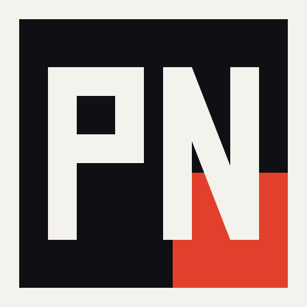

<p align="center">
  
</p>

<h1 align="center">PlayNext</h1>

<p align="center">
  <strong>Fini le « on joue à quoi ce soir ? »</strong><br>
  Application Windows pour choisir un jeu entre amis,<br>
  sans y passer la moitié de la soirée sur Discord.
</p>

<p align="center">
  <a href="https://playnext.jeremyduc.dev">Site</a>
  ·
  <a href="https://github.com/JeremyDuc73/PlayNext/releases/latest/download/PlayNext-Setup.exe">Télécharger</a>
  ·
  <a href="https://github.com/JeremyDuc73/PlayNext/releases">Versions</a>
</p>

---

PlayNext rassemble vos bibliothèques **Steam, Xbox, Epic et Riot**, trouve les jeux que tout le monde peut lancer, et organise un vote secret. Un bulletin, pas un launcher.

## Comment ça marche

1. **Vous piochez** — chacun met de côté 1 à 5 jeux parmi ceux que tout le monde a.
2. **Vous votez** — Chaud, Pourquoi pas ou Pass, tout le monde en même temps, sans se spoiler.
3. **Le veto** — un jeu te saoule ? Tu le sors de la soirée, et c’est réglé.
4. **On lance** — le jeu qui met tout le monde d’accord l’emporte. Égalité ? La roulette tranche.

## Bibliothèques

- Détection locale des jeux installés. Les chemins de fichiers restent sur le PC.
- Possession Steam, Xbox et Epic pour distinguer « on l’a » et « on l’a installé ».
- Steam Family : seuls les jeux jouables en même temps apparaissent en commun.
- Les solos sont écartés des propositions. On garde le multijoueur.
- Ajout manuel depuis le catalogue si un titre manque.

## Groupe

- Connexion Discord, invitations par lien, rôles.
- Bibliothèque croisée du groupe, jeux masqués.
- Bot Discord : lobby ouvert, vote, jeu retenu, propositions Steam — sans divulguer les bulletins.
- Propositions d’achat : Chaud ou Non, unanimité, majorité ou quorum.

## Télécharger

Windows 10 / 11, 64-bit. Installation par utilisateur, sans droits administrateur.

**[Télécharger PlayNext-Setup.exe](https://github.com/JeremyDuc73/PlayNext/releases/latest/download/PlayNext-Setup.exe)**

À la première ouverture, Windows SmartScreen peut afficher « Windows a protégé votre ordinateur ». Cliquer **Informations complémentaires**, puis **Exécuter quand même**. Une seule fois.

Licence [MIT](./LICENSE). Sans publicité, sans revente de données.

## Développement

Monorepo : app Windows (Tauri 2 + React), API (Fastify + PostgreSQL), site public (Astro).

```bash
cp .env.example .env
npm install
npm run docker:up
npm run dev:api
```

| Commande | Rôle |
|----------|------|
| `npm run dev:ui` | Interface dans le navigateur |
| `npm run dev:desktop` | App native Tauri |
| `npm run dev -w @playnext/web` | Site public |
| `npm run typecheck` | Types API + desktop |

Prérequis : Node.js 20+, Docker (Postgres + Redis). Rust + WebView2 pour le shell Windows.
